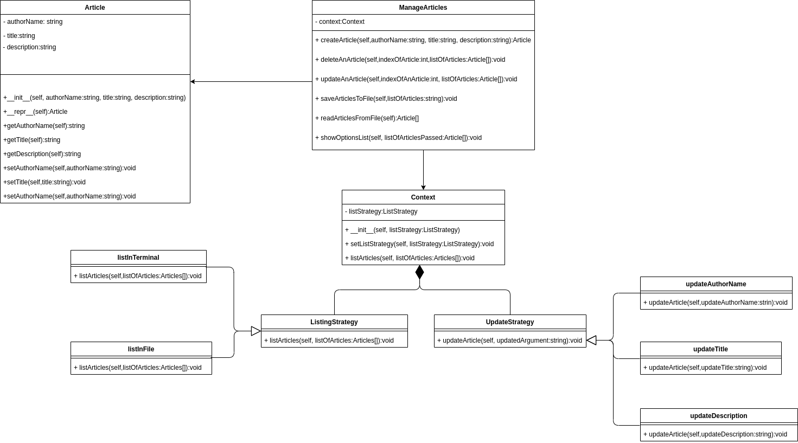

# MagazineTask

# Steps to Run the Project
1) make sure you've installed python 3.7 if you don't have it 
2) Open the project using pycharm IDE
3) at the right top of the IDE press "Add Configurations"
4) click the "+" sign at the left top to add new configuration
5) choose "python"
6) setup python interpreter to "Ptython 3.7 (MagazineTask)"
7) setup the script path to "MagazineTask.py" file location
8) press ok and run the project

# Class Diagram

# Requirements
- List of articles.
- Create article.
- Delete article.
- Update article.
- Well organized code is a MUST.
- Edit README to include the required steps to run your application.

# Stack
-  NodeJS  / Python .

# nice to have
- Unit tests.

# Task Deadline
- Monday Morning 20/07/2020.
