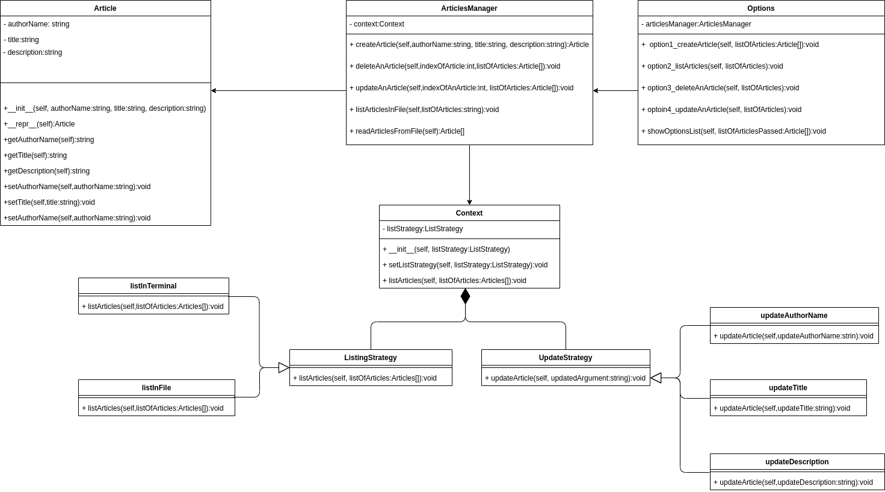

# MagazineTask

# Steps to Run the Project
- Using an existing python 3.7 interpreter
  1) make sure you've installed python 3.7 if you don't have it 
  2) Open the project using pycharm IDE
  3) at the right top of the IDE press "Add Configurations"
  4) click the "+" sign at the left top to add new configuration
  5) choose "python"
  6) setup python interpreter to "Python 3.7"
  7) setup the script path to "path/to/MagazineTask.py"
  8) press ok and run the project

- Using virtualenv interpreter
  1) install puthon 3.7 if you din't have it
  2) open pycharm and create new project
  3) extend the "project interpreter option"
  4) select new enviroment using and choose "virtualenv" option
  5) choose the base interpreter "python 3.7" and press "create"
  6) at the right top of the IDE press "Add Configurations"
  7) click the "+" sign at the left top to add new configuration
  8) choose "python"
  9) setup python interpreter to "Python 3.7 (folder name)"
  10) setup the script path to "path/to/MagazineTask.py"
  11) press ok and run the project

# Class Diagram

# Design Decisions/Alternatives
- DataBase is a must but, due to some minor complexity in extracting the databse and upload it to github. I have used files instead (you can find the file in the project root under the name "articles") to save some time.
- Whether printing the list of articles in the terminal(list the article option) or save the list to a file at the end of the execution(list in file), they are both the same strategy but different algorithm,hence the need to use strategy design pattern,
- Although it's a relatively small project, from my own point of view, "Article & ManageArticles" classes shouldn't be merged into one class. "Article" should have the information about articles only and "ManageArticles" should have the functions to manage the articles, to avoid "Large class smell code" and gaurntee that each class have only one resposibility(single responsibility principle).
- There is a switch statment in the code which might not be the best solution as if it get more complec than this we might face the "Object Oriented Abusers Smell Code" but, as it not too complex only consisting of 4 statments. However if it gets more complex we can use polymorphism to solve it by creating an "Option" Interface and "Create, List, Update and Delete" can inheret from it. 
- Test cases are not completed
- "articles" file is not made to be human readable, it's used only as a storage file to be interpreted by the machine and read/write the list of articles from/to
